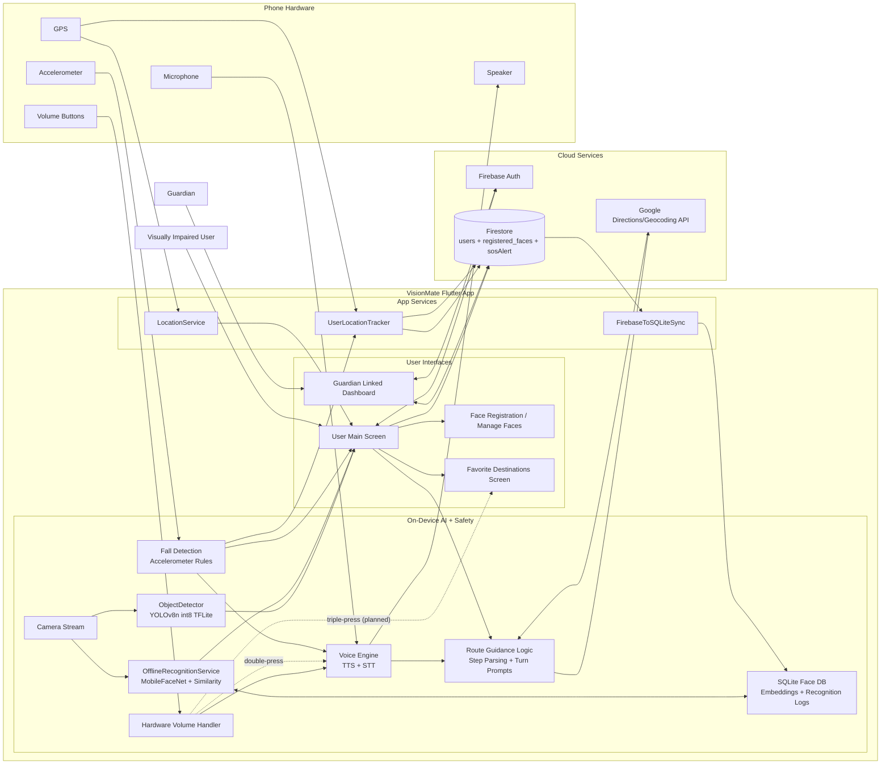

# VisionMate Refined System Architecture (Current + Planned)

## Notes

- Implemented now:
  - Object detection: `assets/models/yolov8n_int8.tflite` via `ObjectDetector`.
  - Offline face recognition: `OfflineRecognitionService` + `MobileFaceNetService` + local SQLite embeddings.
  - Fall safety workflow: free-fall + impact logic, countdown prompt, SOS to Firestore.
  - Guardian sync: location/battery updates and SOS records via `UserLocationTracker`.
  - Voice pipeline: TTS/STT with volume-button trigger flow.

- Planned/remaining:
  - Triple-press volume shortcut to Favorite Destinations (shown as dashed planned link).

- Suggested figure caption for report:
  - "Refined VisionMate architecture showing on-device perception, guardian cloud synchronization, emergency safety loop, and planned triple-press favorite-destination shortcut."